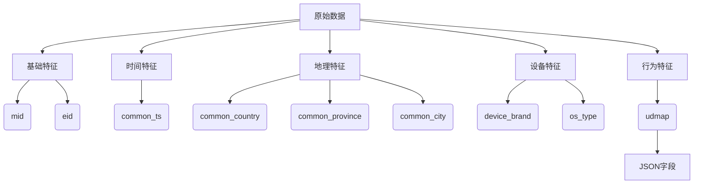

### 一、赛题核心解析
**任务类型**：二分类预测  
**预测目标**：判断用户是否为新增用户（`is_new_did`）  
**评价指标**：F1-score（适用于样本不平衡场景）  
**业务价值**：
- 精准预测用户增长趋势
- 优化产品迭代方向
- 降低用户获取成本

**输入数据特征**：


### 二、关键数据洞察
1. **数据分布特征**：
   - 测试集93%用户出现在训练集中
   - 训练集88%样本为负例（非新增用户）
   - 存在明显样本不平衡问题

2. **特征工程方向**：
   - **时间特征**：从`common_ts`提取时段、停留时长等
   - **地理特征**：省份、城市层级关系
   - **设备特征**：品牌/OS组合特征
   - **JSON解析**：`udmap`中的`botId`和`pluginId`

### 三、Baseline方案解析
**核心架构**：
```python
数据预处理 → 特征工程 → LightGBM建模 → 阈值优化 → 结果提交
```

**关键技术点**：
1. **五折分层交叉验证**：
   ```python
   kf = StratifiedKFold(n_splits=5, shuffle=True)
   for fold, (train_idx, val_idx) in enumerate(kf.split(X, y)):
       # 训练/验证集划分
       # LightGBM模型训练
   ```

2. **动态阈值优化**：
   ```python
   def find_optimal_threshold(y_true, y_pred_proba):
       best_threshold = 0.5
       for threshold in [0.1, 0.15, 0.2, 0.25, 0.3]:
           y_pred = (y_pred_proba >= threshold).astype(int)
           f1 = f1_score(y_true, y_pred)
           # 保留最佳阈值
       return best_threshold
   ```

3. **LightGBM优势**：
   - 训练速度比XGBoost快3-5倍
   - 自动处理缺失值
   - 直方图算法优化内存使用

### 四、进阶上分策略
1. **特征工程增强**：
   - 解析`udmap`JSON字段：
     ```python
     df['botId'] = df['udmap'].apply(lambda x: json.loads(x).get('botId'))
     ```
   - 构建组合特征：设备品牌×省份×时段
   - 时间序列特征：用户行为频率/间隔

2. **数据聚合策略**：
   ```mermaid
   graph LR
       A[原始事件数据] --> B[按did聚合]
       B --> C[统计特征]
       C --> D[每个用户1条记录]
       D --> E[用户级预测]
   ```

3. **样本利用优化**：
   - 已知标签直接使用（测试集与训练集重复did）
   - 半监督学习：用预测置信度高的样本扩充训练集

4. **模型集成**：
   - Stacking多层模型
   - 结合树模型与神经网络优势

### 五、关键注意事项
1. **数据泄露预防**：
   - 使用5-fold Target Encoding
   - 确保验证集完全隔离

2. **长尾分布处理**：
   - 设备品牌等低频类别合并为"其他"
   - 分层抽样保证分布一致性

3. **评估陷阱**：
   - 避免仅用准确率（Accuracy）评价
   - 关注混淆矩阵和PR曲线

> 核心公式：F1-score = $\frac{2 \times Precision \times Recall}{Precision + Recall}$